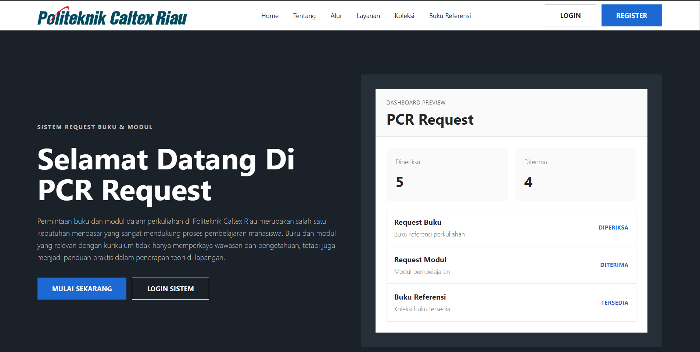

# Book-Request_V2

A modern, responsive library request management system built for handling academic book and module requests. This project allows students and academic staff to submit requests, track request statuses, view reference books, and enables library staff to manage requests through an admin dashboard.



## Live Demo

[View Live Website](https://book-request-v2.vercel.app/)

## Repository

[GitHub Repository](https://github.com/Ananta-TI/Book-Request_V2.git)

## Overview

Book-Request_V2 is a web-based library request system designed to support the academic environment of Politeknik Caltex Riau. The system helps organize book and module request workflows in a clearer, faster, and more structured way.

Instead of using manual records or scattered communication, this application provides a centralized platform where users can submit requests, monitor request progress, and manage reference book data.

## Key Features

### User Authentication

Users can register and log in using their full name and student or staff ID. User roles are stored in the database, so the system can control access based on the registered role.

### Role-Based Access

The application supports different user roles:

* Students can submit book and module requests.
* Academic staff can submit book and module requests for learning needs.
* Library staff can manage all requests, update request statuses, view statistics, and manage reference books.

### Book Request

Students and academic staff can submit book requests by filling in details such as book title, author, publisher, estimated price, study program, and book type.

### Module Request

Users can submit module or learning material requests with subject information, estimated price, study program, and optional file URL.

### Request Tracking

Users can view their submitted requests and monitor the current status, such as:

* Diperiksa
* Diterima
* Ditolak
* Dicetak
* Selesai

### Admin Request Management

Library staff can view all incoming requests and update their status directly from the admin panel.

### Reference Book Management

The system includes a reference book section where users can view available academic books. Library staff can add, edit, delete, and upload book cover images.

### Dashboard and Statistics

The dashboard displays request summaries based on user role. Library staff can view overall request data, while students and academic staff can view their own request statistics.

### Responsive Design

The application is designed to work across multiple screen sizes, including:

* Desktop
* Laptop
* Tablet
* iPad
* Mobile phones

## Tech Stack

This project was built using:

* React
* Vite
* Tailwind CSS
* Supabase
* React Router
* Vercel

## Project Structure

```bash
Book-Request_V2/
├── public/
│   └── image/
│       └── image.png
│
├── src/
│   ├── components/
│   │   ├── Navbar.jsx
│   │   ├── ProtectedRoute.jsx
│   │   └── RoleRoute.jsx
│   │
│   ├── lib/
│   │   └── supabaseClient.js
│   │
│   ├── pages/
│   │   ├── AddBook.jsx
│   │   ├── AdminRequests.jsx
│   │   ├── BookRequest.jsx
│   │   ├── BukuReferensi.jsx
│   │   ├── Dashboard.jsx
│   │   ├── DataRequest.jsx
│   │   ├── EditBook.jsx
│   │   ├── GrafikRequest.jsx
│   │   ├── Landing.jsx
│   │   ├── Login.jsx
│   │   ├── ModuleRequest.jsx
│   │   ├── MyRequests.jsx
│   │   ├── Register.jsx
│   │   └── RoleLogin.jsx
│   │
│   ├── services/
│   │   └── authService.js
│   │
│   ├── App.jsx
│   ├── index.css
│   └── main.jsx
│
├── index.html
├── package.json
├── vite.config.js
├── vercel.json
└── README.md
```

## User Roles

| Role           | Access                                                                                        |
| -------------- | --------------------------------------------------------------------------------------------- |
| Student        | Submit book requests, submit module requests, view own request data, view reference books     |
| Academic Staff | Submit book requests, submit module requests, view own request data, view reference books     |
| Library Staff  | Manage all requests, update request statuses, view request statistics, manage reference books |

## Request Status Flow

```text
Diperiksa → Diterima / Ditolak → Dicetak → Selesai
```

The status flow helps users understand where their request currently stands in the library process.

## Database Tables

This project uses Supabase as the backend service. The main tables used in this project include:

### app_users

Stores registered users and their roles.

Main fields:

* id
* full_name
* user_code
* role
* prodi
* created_at

### requests

Stores book and module request data.

Main fields:

* id
* requester_name
* requester_id
* requester_role
* request_type
* request_date
* title
* author
* publisher
* subject_name
* estimated_price
* prodi
* book_type
* module_file_url
* status
* created_at

### book_references

Stores reference book data.

Main fields:

* id
* title
* author
* publisher
* estimated_price
* prodi
* book_type
* updated_date
* image_url
* created_at

## Installation

Clone the repository:

```bash
git clone https://github.com/Ananta-TI/Book-Request_V2.git
```

Go to the project directory:

```bash
cd Book-Request_V2
```

Install dependencies:

```bash
npm install
```

Run the development server:

```bash
npm run dev
```

Build for production:

```bash
npm run build
```

Preview production build locally:

```bash
npm run preview
```

## Environment Variables

Create a `.env` file in the root directory and add your Supabase credentials:

```env
VITE_SUPABASE_URL=your_supabase_project_url
VITE_SUPABASE_ANON_KEY=your_supabase_anon_key
```

Do not expose sensitive service role keys in the frontend.

## Supabase Setup

Before running the project, make sure the required Supabase tables and storage bucket are already created.

Recommended storage bucket for book cover uploads:

```text
book-covers
```

The bucket is used to store uploaded reference book cover images.

## Deployment

This project is deployed using Vercel.

The project includes `vercel.json` to support client-side routing with React Router:

```json
{
  "rewrites": [
    {
      "source": "/(.*)",
      "destination": "/index.html"
    }
  ]
}
```

This prevents 404 errors when refreshing pages such as `/dashboard`, `/buku-referensi`, or `/admin/requests`.

## Main Pages

| Page           | Description                               |
| -------------- | ----------------------------------------- |
| Landing        | Public homepage explaining the system     |
| Login          | User login page                           |
| Register       | User registration page                    |
| Dashboard      | Role-based dashboard                      |
| Request Buku   | Book request form                         |
| Request Modul  | Module request form                       |
| Data Request   | User request history                      |
| Admin Requests | Request management page for library staff |
| Grafik Request | Request statistics page                   |
| Buku Referensi | Reference book collection                 |
| Add Book       | Add reference book page                   |
| Edit Book      | Edit reference book page                  |

## Screenshots

### Main Demo


## Future Improvements

Potential improvements for future versions:

* Add real-time request notifications.
* Add advanced filtering and search for request data.
* Add file upload support for module request attachments.
* Add user profile management.
* Add pagination for large datasets.
* Add export to PDF or Excel for request reports.
* Improve admin analytics with charts and trend visualization.

## Author

Developed by Ananta Firdaus.

## License

This project is intended for academic and portfolio purposes.
